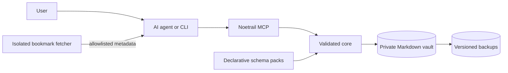

# Noetrail

[](https://github.com/patsch1/noetrail/actions/workflows/ci.yml)
[][license]
[][pyproject]
[][coverage-tool]
[][pyproject]

Noetrail is a local-first, agent-friendly knowledge vault. Notes remain
readable Markdown files; AI agents use a narrow CLI or MCP interface to capture,
search, relate, review, and safely update them.

**Built by AI agents.** Noetrail is vibe-coded. Its code, tests, and
documentation were written by AI coding agents directed by one human
maintainer, who reviews the result and is accountable for what ships. Six CI
gates stand in for a person typing every line.
[How this project was built][ai-authorship] says what that does and
does not mean — worth reading before you point this at your private notes.

> **Private by design:** source control contains the program, schemas, skills,
> synthetic examples, and documentation. A real `vault/`, `trash/`,
> `imports/raw/`, and `imports/work/` belong on private storage and in its
> authorized backups, never in Git.

Noetrail currently supports:

- thoughts, notes, memories, people, projects, media, places, products, and
  recipes;
- reusable experiences such as tastings, visits, meals, and cooking events;
- reading queues and enriched bookmarks with personal notes kept separate from
  fetched metadata;
- private, content-addressed image attachments;
- search that runs a literal substring match and an Okapi BM25 ranking
  together and returns the union, over an optional derived index that is
  verified against the files before every use and can be deleted at any time;
- a vector sidecar interface for an embedding provider you run yourself, with
  no model, no dependency, and no network call added to Noetrail;
- stable IDs, typed relations, optimistic revisions, and a shared vault lock;
- searchable aliases for explicitly grounded alternative names;
- an inbox/review workflow and reversible trash;
- declarative saved views for recurring filtered lists;
- declarative, non-executable schema packs for user-defined types;
- idempotent local Markdown imports with retained provenance;
- a dependency-free Python CLI, a narrow Noetrail MCP server, and an isolated
  SSRF-hardened bookmark metadata fetcher;
- host-neutral agent workflows plus an optional hardened ZeroClaw overlay.

## One agent turn

![Recorded terminal session: a bounded search, a capture that lands in the review inbox, the review queue, and a validation run][demo-recording]

This is a recording, not an illustration. [`demo/session.sh`][demo-session]
runs those four commands against a disposable copy of the synthetic demo vault;
`tools/render_terminal_svg.py` executes the script and draws whatever came
back. The plain-text transcript is
[`docs/assets/demo.txt`][demo-transcript], and the test suite re-runs the
session and fails if the recording no longer matches the program's output.

## Start with one command

`noetrail quickstart` creates an instance, writes a few sample entries, and
prints the exact MCP server block your client wants. Nothing else to decide.

**After the production PyPI upload** — no checkout, no virtual environment:

<!-- docs-check: skip - uvx and pipx run install from a package index over the network -->

```sh
uvx noetrail quickstart          # or: pipx run noetrail quickstart
```

That line is not live yet on PyPI. `0.10.0a1` is available from the
[GitHub prerelease](https://github.com/patsch1/noetrail/releases/tag/v0.10.0a1)
and [TestPyPI](https://test.pypi.org/project/noetrail/0.10.0a1/); see
[installation](https://github.com/patsch1/noetrail/blob/main/docs/installation.md#install-single-user-own-machine) for the
TestPyPI command. A checkout also works. Python 3.11 or newer, no third-party
dependencies:

<!-- docs-check: skip - installs from the network; the doc runner substitutes a local entry point -->

```sh
git clone https://github.com/patsch1/noetrail
cd noetrail
python3 -m venv .venv
.venv/bin/python -m pip install .
```

Then the same single command:

```sh
DEMO_ROOT="$(mktemp -d)"

.venv/bin/noetrail quickstart --path "$DEMO_ROOT"
```

It prints the two roots it created, the sample entries it wrote, and the
client configuration below. Run `search`, `review`, or `inventory` against it
straight away:

```sh
.venv/bin/noetrail \
  --data-root "$DEMO_ROOT/data" \
  --config-root "$DEMO_ROOT/config" \
  doctor
```

The longer walkthrough adds a custom schema pack and two imports:
[Five-minute quickstart][quickstart].

## Connecting an agent

Noetrail's primary agent boundary is a stdio MCP server, and `quickstart`
prints this block filled in with your own absolute paths. Any MCP-capable
client takes it:

```json
{
  "mcpServers": {
    "noetrail": {
      "command": "noetrail-mcp",
      "args": ["--data-root", "/absolute/data", "--config-root", "/absolute/config"]
    }
  }
}
```

See [Connecting an MCP client][mcp-clients] for the tool
surface, concurrency rules, and attachment handling.

## Agent-facing examples

A connected agent can turn ordinary requests into validated operations:

- “Remember this thought and leave it in my review inbox.”
- “Save this article as unread.”
- “Which drinks are still on my wishlist?”
- “I visited this bar yesterday, rated it four stars, and attached two photos.”
- “Show unresolved relationships and bookmarks without a personal note.”

The agent never needs a generic shell or arbitrary filesystem access. It uses
typed operations such as `inventory`, `capture`, `search`, `retrieve`,
`run_view`, `update`, `add_attachment`, `trash`, and `restore`. Search returns compact, stably
ordered pages with an explicit total and continuation offset, so an agent can
answer large-list questions without silently truncating them or flooding its
model context.

## Architecture



Markdown is the source of truth. The core owns IDs, timestamps, revisions,
locking, lifecycle, attachments, provenance, trash, and migrations. Schema
packs define typed attributes and static body structure without Python, shell,
network calls, or executable hooks.

Program resources, instance configuration, and personal data can be mounted
separately:

```text
/opt/noetrail/          installed read-only program and built-ins
/etc/noetrail/          instance configuration and local schema packs
/srv/noetrail-data/     private vault, trash, imports, locks, attachments
```

The older combined `--root` layout remains a compatibility surface for
existing deployments.

## Declarative custom types

Local schema packs live below `<config-root>/packs/`. For example, the
synthetic demo defines `travel/destination` with required `country`, an enum
visit state, and searchable highlights. The same registry drives CLI
validation, search filters, generated JSON Schema, and MCP input schemas.

See [Declarative schema packs][schema-packs] and the
[synthetic demo pack][travel-pack].

Recurring filtered lists can be named in a data-only `views.yaml`; see
[Declarative saved views][saved-views]. Pack authors can scaffold an inert
candidate with `noetrail schema init` and validate it before installation with
`noetrail schema validate-pack`.

## Bringing an existing vault

Copy the vault below `<data-root>/imports/raw/`, preview the plan, then apply
it explicitly. Three importers exist:

<!-- docs-check: skip - illustrative deployment paths, not a runnable example -->

```sh
noetrail --data-root /srv/noetrail-data --config-root /etc/noetrail \
  import obsidian --source my-obsidian-vault

noetrail --data-root /srv/noetrail-data --config-root /etc/noetrail \
  import obsidian --source my-obsidian-vault --apply
```

- `import markdown` — plain UTF-8 Markdown files, no link or tag handling.
- `import obsidian` — wikilinks become typed relations, embedded images
  become content-addressed attachments, frontmatter and inline `#tags` become
  entry tags, and `.obsidian/`, canvas files, Dataview blocks, and Templater
  syntax are reported rather than silently swallowed.
- `import basic-memory` — frontmatter, `## Observations`, and typed
  `## Relations` lines.

All three are dry-run by default, derive stable entry IDs, record a content
hash so an unchanged repeat creates nothing, and roll back completely if a
write fails. What could not be converted is listed in the report. See
[Importing notes][importing].

## Ways to run it

Noetrail is one Python package with no runtime dependencies, so how it runs is
your choice rather than a prerequisite:

- **On your machine.** `noetrail quickstart`, then point a desktop MCP client
  at the printed configuration. This is the default and needs nothing else.
- **On a server you already have.** Install the wheel into a virtual
  environment, keep data, instance configuration, and program on separate
  paths, and back up the data root. See
  [Installation and lifecycle][installation].
- **In a hardened container with a chat channel.** One supported option, not a
  requirement. The knowledge agent gets only selected narrow MCP tools and no
  shell, generic filesystem, web, Kubernetes, secret, or
  backup access; untrusted web pages are processed by a separate fetcher
  without a vault mount. See [ZeroClaw setup][zeroclaw-setup]
  and [ZeroClaw security][zeroclaw-security].

## Development and release checks

<!-- docs-check: skip - `make check` is the suite that runs this check -->

```sh
make check
make release-check
```

`make check` runs the synthetic test suite, validates the local development
vault when present, scans for common secrets, and verifies the Git/private-data
boundary. `make release-check` builds the source distribution and runs the
suite inside the unpacked archive, then builds a wheel, installs it in a clean
virtual environment, migrates a synthetic schema-8 vault to schema 12, validates
it, restores the pre-migration backup, and validates that rollback boundary.

Noetrail `0.10.0a1` is the first public alpha, available on GitHub and TestPyPI.
The release workflow
builds the wheel and source distribution, rebuilds them and compares, attaches
a build-provenance attestation and a CycloneDX bill of materials, and uploads
to PyPI through Trusted Publishing from a protected environment. The source
repository is public. Making the PyPI project exist is still a separate human
decision. See
[Release process][releasing], [versioning][versioning], and
[current release notes][release-notes].

## Documentation

- [Five-minute quickstart][quickstart]
- [Architecture][architecture]
- [Connecting an MCP client][mcp-clients]
- [Installation and lifecycle][installation]
- [Application, configuration, and data layout][layout]
- [Declarative schema packs][schema-packs]
- [Importing notes][importing]
- [Limits and scaling][limits] — measured search, index, and retrieval
  numbers
- [Embeddings][embeddings] — the vector sidecar interface, and why no
  provider ships with it
- [Privacy boundaries][privacy]
- [Backup and restore][backup-restore]
- [Release process][releasing]
- [Architecture decision records][adr]
- [How this project was built][ai-authorship]
- [The Noetrail mark][logo-note] — which logo file to use
  where, and why the shape is what it is

## Project

- [How this project was built][ai-authorship] — written by AI agents,
  and what that means for a reader
- [Roadmap][roadmap] — what comes after `0.10`, and what is deliberately out
  of scope
- [Contributing][contributing] and [AGENTS.md][agents] — the six gates a
  change has to pass, for humans and for agents
- [Code of conduct][code-of-conduct]
- [Security policy][security] — private reporting, response times, and how
  release artifacts can be verified
- [Support][support] — what this project does and does not support
- [Decision log][decision-log] — the retrospective record of
  how the project got here

Noetrail is licensed under the [Apache License 2.0][license]. Personal vault
content is separate data and is not relicensed by this repository.

[adr]: https://github.com/patsch1/noetrail/tree/main/docs/adr/
[agents]: https://github.com/patsch1/noetrail/blob/main/AGENTS.md
[ai-authorship]: https://github.com/patsch1/noetrail/blob/main/docs/ai-authorship.md
[architecture]: https://github.com/patsch1/noetrail/blob/main/docs/architecture.md
[backup-restore]: https://github.com/patsch1/noetrail/blob/main/docs/backup-restore.md
[code-of-conduct]: https://github.com/patsch1/noetrail/blob/main/CODE_OF_CONDUCT.md
[contributing]: https://github.com/patsch1/noetrail/blob/main/CONTRIBUTING.md
[coverage-tool]: https://github.com/patsch1/noetrail/blob/main/tools/coverage.py
[decision-log]: https://github.com/patsch1/noetrail/blob/main/docs/internal/decision-log.md
[demo-recording]: https://raw.githubusercontent.com/patsch1/noetrail/main/docs/assets/demo.svg
[demo-session]: https://github.com/patsch1/noetrail/blob/main/demo/session.sh
[demo-transcript]: https://github.com/patsch1/noetrail/blob/main/docs/assets/demo.txt
[embeddings]: https://github.com/patsch1/noetrail/blob/main/docs/embeddings.md
[importing]: https://github.com/patsch1/noetrail/blob/main/docs/importing.md
[installation]: https://github.com/patsch1/noetrail/blob/main/docs/installation.md
[layout]: https://github.com/patsch1/noetrail/blob/main/docs/layout.md
[license]: https://github.com/patsch1/noetrail/blob/main/LICENSE
[limits]: https://github.com/patsch1/noetrail/blob/main/docs/limits.md
[logo-note]: https://github.com/patsch1/noetrail/blob/main/docs/assets/noetrail-logo.md
[mcp-clients]: https://github.com/patsch1/noetrail/blob/main/docs/integrations/mcp-clients.md
[privacy]: https://github.com/patsch1/noetrail/blob/main/docs/privacy.md
[pyproject]: https://github.com/patsch1/noetrail/blob/main/pyproject.toml
[quickstart]: https://github.com/patsch1/noetrail/blob/main/docs/quickstart.md
[release-notes]: https://github.com/patsch1/noetrail/blob/main/docs/releases/0.10.0a1.md
[releasing]: https://github.com/patsch1/noetrail/blob/main/docs/releasing.md
[roadmap]: https://github.com/patsch1/noetrail/blob/main/ROADMAP.md
[schema-packs]: https://github.com/patsch1/noetrail/blob/main/docs/schema-packs.md
[saved-views]: https://github.com/patsch1/noetrail/blob/main/docs/saved-views.md
[security]: https://github.com/patsch1/noetrail/blob/main/SECURITY.md
[support]: https://github.com/patsch1/noetrail/blob/main/SUPPORT.md
[travel-pack]: https://github.com/patsch1/noetrail/blob/main/demo/config/packs/travel/pack.yaml
[versioning]: https://github.com/patsch1/noetrail/blob/main/docs/versioning.md
[zeroclaw-security]: https://github.com/patsch1/noetrail/blob/main/docs/integrations/zeroclaw-security.md
[zeroclaw-setup]: https://github.com/patsch1/noetrail/blob/main/docs/integrations/zeroclaw-setup.md
