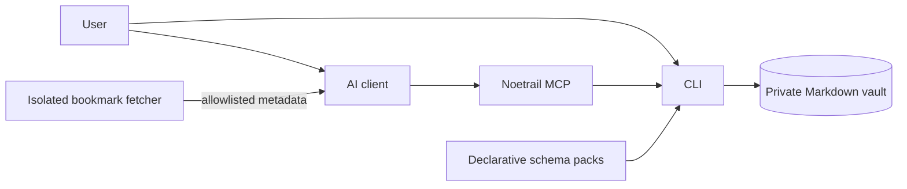

# Noetrail

[](https://github.com/patsch1/noetrail/actions/workflows/ci.yml)
[][license]
[][pyproject]
[][coverage-tool]
[][pyproject]

Noetrail is a local-first Markdown knowledge vault for people and AI agents.
Capture notes, link related entries, and retrieve stored knowledge through a
Python CLI or a bounded Model Context Protocol (MCP) server. Markdown files
remain the source of truth and can be read without Noetrail.

**Status:** `0.10.0a1` is a public alpha, available on
[PyPI](https://pypi.org/project/noetrail/0.10.0a1/),
[GitHub](https://github.com/patsch1/noetrail/releases/tag/v0.10.0a1), and
[TestPyPI](https://test.pypi.org/project/noetrail/0.10.0a1/).
Python 3.11 or newer is required. The Python runtime has no third-party
package dependencies. CLI and MCP interfaces may change during the alpha;
see [versioning and compatibility][versioning].

**AI-developed, maintainer-directed.** The code, tests, and documentation were
written by AI coding agents under one human maintainer's direction. The
maintainer is responsible for what ships. Automated checks support review;
they do not prove correctness. [Development process][ai-authorship].

## Get started

With [uv](https://docs.astral.sh/uv/getting-started/installation/) installed,
run the published alpha without a source checkout:

<!-- docs-check: skip - uvx installs from a package index over the network -->

```sh
uvx --from 'noetrail==0.10.0a1' noetrail quickstart
```

`quickstart` creates `~/noetrail/data` and `~/noetrail/config`, adds three
sample entries, and prints an MCP configuration with absolute data and configuration paths. Use
`--path` to choose another instance directory. Repeating the command does not
duplicate the samples.

For a virtual environment, TestPyPI, or a server installation, see
[Installation and lifecycle][installation]. To try the source checkout with
disposable data:

<!-- docs-check: skip - installs from the network; the doc runner substitutes a local entry point -->

```sh
git clone https://github.com/patsch1/noetrail
cd noetrail
python3 -m venv .venv
.venv/bin/python -m pip install .
```

```sh
DEMO_ROOT="$(mktemp -d)"
.venv/bin/noetrail quickstart --path "$DEMO_ROOT"
.venv/bin/noetrail \
  --data-root "$DEMO_ROOT/data" \
  --config-root "$DEMO_ROOT/config" \
  doctor
```

The [five-minute quickstart][quickstart] walks through capture, search, custom
types, and imports. Follow it with synthetic data before using personal notes.

## Connect an AI client

Noetrail exposes a stdio MCP server. `quickstart` prints the absolute data and
configuration paths. For the `uvx` method above, clients that accept a
`mcpServers` configuration can launch the server through `uvx`:

```json
{
  "mcpServers": {
    "noetrail": {
      "command": "uvx",
      "args": [
        "--from", "noetrail==0.10.0a1", "noetrail-mcp",
        "--data-root", "/absolute/data", "--config-root", "/absolute/config"
      ]
    }
  }
}
```

Replace the example roots with the paths printed by `quickstart`. If your
client cannot resolve `uvx`, use its absolute path (`command -v uvx`). For a
virtual-environment installation, use that environment's absolute
`noetrail-mcp` path with the generated arguments. Configuration locations and
protocol versions depend on the host; see [Connecting an MCP client][mcp-clients].

A connected agent can capture a note, find related entries, save an article to
a reading queue, or retrieve an attached image. The vault server exposes typed
operations instead of a generic shell or filesystem API. Bookmark metadata is
fetched through a separate server with no vault access.

## What you can store and do

- **Structured knowledge:** notes, thoughts, memories, people, projects,
  media, places, products, recipes, bookmarks, and experiences such as visits
  or tastings. Entries have stable IDs, typed relations, tags, and timestamps.
- **Capture and review:** an inbox for unreviewed entries, revision checks for
  updates, private image attachments, and whole-entry trash and restore.
- **Retrieval:** literal and BM25 search, grounded alternative names, bounded
  multi-entry retrieval, and saved filtered views. An optional derived index
  can be rebuilt from the Markdown files.
- **Custom types:** declarative schema packs define attributes and validation
  without executable hooks. See [Schema packs][schema-packs] and
  [Saved views][saved-views].
- **Imports:** preview and import plain Markdown, Obsidian, or Basic Memory
  exports with provenance and duplicate handling. See [Importing notes][importing].
- **Optional reranking:** externally supplied vectors can rerank lexical
  candidates. Noetrail ships no embedding model or provider connection.
  See [Embeddings][embeddings].

## Recorded example

![Recorded terminal session: a bounded search, a capture that lands in the review inbox, the review queue, and a validation run][demo-recording]

The recording runs [`demo/session.sh`][demo-session] against a disposable
synthetic vault: search, capture, review, and validation. The test suite
checks the [transcript][demo-transcript] against the program's output.

## Data, privacy, and limits

Personal entries, attachments, imports, and trash belong in the private data
root and its backups. Program files, schemas, skills, and synthetic examples
belong in source control. Instance configuration and local schema packs can
live separately from both. See [Layout][layout] and [Privacy boundaries][privacy].

An AI client connected to the vault can read its entries. A cloud-backed
client may send retrieved content to its model provider; local storage alone
does not prevent that. Sensitivity labels are metadata, not access controls.
Choose a client and provider you trust with the connected vault.

Search is primarily lexical. A paraphrase, typo, or translation may need query
reformulation, and an empty result is not proof that a fact is absent. Vector
reranking does not add entries outside the lexical candidates. See
[Limits and scaling][limits] and [Retrieval evaluation][retrieval-evaluation].

Back up the complete data and configuration roots before upgrades. On-disk
migrations require an explicit preview and apply; restoring a backup is the
rollback path after migration. See [Backup and restore][backup-restore].

## Architecture and deployment



The CLI implements vault rules; MCP mutations invoke that same implementation.
Program resources, instance configuration, and data can use separate paths:

```text
/opt/noetrail/          program and built-ins
/etc/noetrail/          instance configuration and local schema packs
/srv/noetrail-data/     vault, trash, imports, locks, attachments
```

Run Noetrail locally or install it on a shared host. The optional
[ZeroClaw deployment][zeroclaw-setup] adds a constrained knowledge agent and
an isolated web-fetch process; it is one integration, not a requirement.
The [security guide][zeroclaw-security] describes that deployment's controls.

## Development and verification

Install the development tools described in [Contributing][contributing].
Without a local maintainer vault, run the six contributor gates listed there.
With that vault configured:

<!-- docs-check: skip - make check is the suite that runs this check -->

```sh
make check
make release-check
```

Changes pass lint, type checking, synthetic tests, coverage, secret scanning,
and the Git/private-data boundary check. `make check` also validates a local
maintainer vault; it requires one. `make release-check` tests an unpacked source
distribution and a freshly installed wheel, including synthetic migration and
restore acceptance. CodeQL runs alongside CI on public changes.

Noetrail `0.10.0a1` is available on PyPI, GitHub and TestPyPI. Release artifacts
include checksums, build provenance, and a CycloneDX bill of materials.
The source repository is public. Each future package upload requires
maintainer approval. See [Release process][releasing] and
[current release notes][release-notes].

## Documentation and project

- [Five-minute quickstart][quickstart] · [Installation][installation] ·
  [Connecting an MCP client][mcp-clients]
- [Architecture][architecture] · [Layout][layout] · [Privacy][privacy] ·
  [Backup and restore][backup-restore]
- [Schema packs][schema-packs] · [Saved views][saved-views] ·
  [Importing notes][importing] · [Search limits][limits]
- [Roadmap][roadmap] · [Decision log][decision-log] ·
  [Architecture decision records][adr]
- [Contributing][contributing] · [AGENTS.md][agents] ·
  [Development process][ai-authorship]
- [Support][support] · [Security policy][security] ·
  [Code of conduct][code-of-conduct]

Noetrail is licensed under the [Apache License 2.0][license]. Personal vault
content is separate data and is not relicensed by this repository.

[adr]: https://github.com/patsch1/noetrail/tree/main/docs/adr/
[agents]: https://github.com/patsch1/noetrail/blob/main/AGENTS.md
[ai-authorship]: https://github.com/patsch1/noetrail/blob/main/docs/ai-authorship.md
[architecture]: https://github.com/patsch1/noetrail/blob/main/docs/architecture.md
[backup-restore]: https://github.com/patsch1/noetrail/blob/main/docs/backup-restore.md
[code-of-conduct]: https://github.com/patsch1/noetrail/blob/main/CODE_OF_CONDUCT.md
[contributing]: https://github.com/patsch1/noetrail/blob/main/CONTRIBUTING.md
[coverage-tool]: https://github.com/patsch1/noetrail/blob/main/tools/coverage.py
[decision-log]: https://github.com/patsch1/noetrail/blob/main/docs/internal/decision-log.md
[demo-recording]: https://raw.githubusercontent.com/patsch1/noetrail/main/docs/assets/demo.svg
[demo-session]: https://github.com/patsch1/noetrail/blob/main/demo/session.sh
[demo-transcript]: https://github.com/patsch1/noetrail/blob/main/docs/assets/demo.txt
[embeddings]: https://github.com/patsch1/noetrail/blob/main/docs/embeddings.md
[importing]: https://github.com/patsch1/noetrail/blob/main/docs/importing.md
[installation]: https://github.com/patsch1/noetrail/blob/main/docs/installation.md
[layout]: https://github.com/patsch1/noetrail/blob/main/docs/layout.md
[license]: https://github.com/patsch1/noetrail/blob/main/LICENSE
[limits]: https://github.com/patsch1/noetrail/blob/main/docs/limits.md
[logo-note]: https://github.com/patsch1/noetrail/blob/main/docs/assets/noetrail-logo.md
[mcp-clients]: https://github.com/patsch1/noetrail/blob/main/docs/integrations/mcp-clients.md
[privacy]: https://github.com/patsch1/noetrail/blob/main/docs/privacy.md
[pyproject]: https://github.com/patsch1/noetrail/blob/main/pyproject.toml
[quickstart]: https://github.com/patsch1/noetrail/blob/main/docs/quickstart.md
[release-notes]: https://github.com/patsch1/noetrail/blob/main/docs/releases/0.10.0a1.md
[releasing]: https://github.com/patsch1/noetrail/blob/main/docs/releasing.md
[roadmap]: https://github.com/patsch1/noetrail/blob/main/ROADMAP.md
[schema-packs]: https://github.com/patsch1/noetrail/blob/main/docs/schema-packs.md
[saved-views]: https://github.com/patsch1/noetrail/blob/main/docs/saved-views.md
[security]: https://github.com/patsch1/noetrail/blob/main/SECURITY.md
[support]: https://github.com/patsch1/noetrail/blob/main/SUPPORT.md
[travel-pack]: https://github.com/patsch1/noetrail/blob/main/demo/config/packs/travel/pack.yaml
[versioning]: https://github.com/patsch1/noetrail/blob/main/docs/versioning.md
[zeroclaw-security]: https://github.com/patsch1/noetrail/blob/main/docs/integrations/zeroclaw-security.md
[zeroclaw-setup]: https://github.com/patsch1/noetrail/blob/main/docs/integrations/zeroclaw-setup.md
[retrieval-evaluation]: https://github.com/patsch1/noetrail/blob/main/docs/retrieval-evaluation.md
