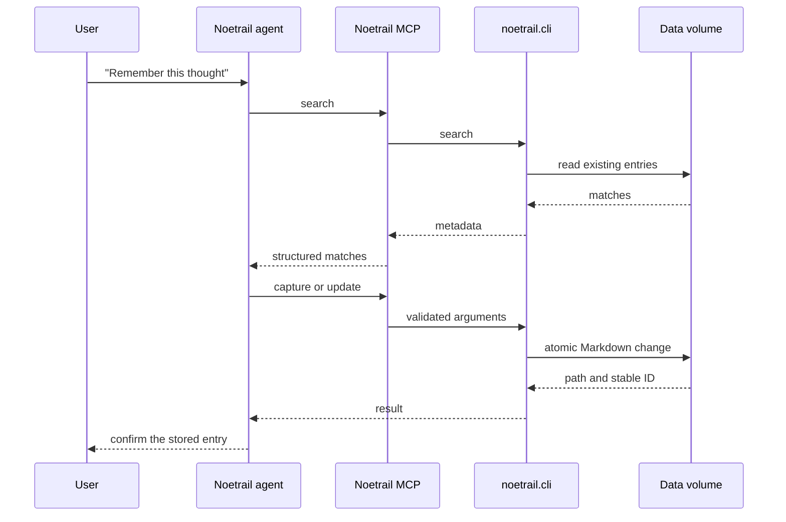
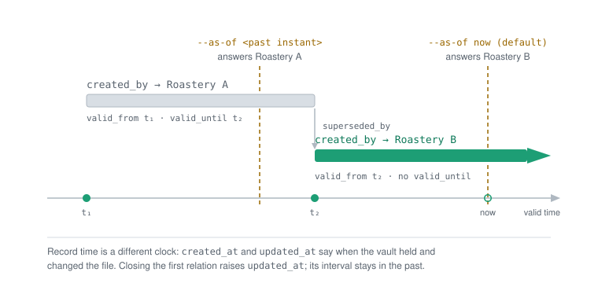

# Noetrail: architecture and decisions

## Goal

Noetrail stores personal knowledge in portable Markdown files and offers agents
a small, deterministic set of operations. The data stays readable, backupable,
and restorable without depending on any particular LLM vendor.

## Components

| Component | Responsibility | Trust level |
| --- | --- | --- |
| Application root | installed program code and entry points | read-only release content |
| `.knowledge/` | schema, relations, templates, and data rules | read-only release content |
| Instance config root | local relation extensions and custom schema packs | read-only during agent operation |
| Instance config `index/` | derived BM25 search cache, the one thing written there | discardable, rebuilt from `vault/` |
| `noetrail.cli` | canonical capture, search, and mutation logic | trusted local code |
| `noetrail.mcp` | typed MCP interface for agents | narrow trusted boundary |
| `noetrail.bookmark_fetcher` | HTTP MCP: public URL to allowlisted metadata | network process without vault access |
| `skills/` | workflows and behavioral rules for agents | instructions, not database logic |
| Attachment inbox | temporary files delivered by a chat channel | read-only source with a fixed root |
| `vault/` | active personal entries and attachments | private data volume |
| `trash/` | reversible deletions | private data volume |
| Backup destination | independent, versioned recovery | private, separate credentials |

## Data flow

The MCP server never writes Markdown itself. It validates structured arguments
and invokes the CLI without shell interpolation, so the CLI remains the single
implementation of the vault rules.

Where that CLI code runs depends on the operation. Mutations and `validate` run
in a separate process, which gives them a hard timeout and isolates the server
from a crash. The frequent bounded reads run inside the server process, because
starting an interpreter costs more than the read itself; see
[Limits and scaling](limits.md) for the measurement. Both paths execute the
same code under the same advisory vault lock, and `--subprocess-reads` forces
every read back into a separate process.

For an incoming chat photo, the host first stores the file in an
agent-specific inbox. If the channel keeps an image marker in the model text,
the agent passes only that channel-supplied path to `add_attachment`.
If shared multimodal preprocessing removes the marker,
`list_pending_attachments` lists only recently received, supported
images as short-lived tokens without a source path. Attaching binds the token
to the previously measured SHA-256 and consumes it on success. In both cases
the CLI accepts only canonical sources beneath the inbox root fixed at server
start, checks type and size, and copies the image content-addressed into
`vault/attachments/`. The agent therefore gets neither a general file-reading
tool nor a freely chosen source root.

In the bookmark and recipe-link workflow, the knowledge agent delegates only
the URL to a second, isolated agent that has nothing but the fetch tool. That
tool is served over HTTP by a separate process without vault access. The
fetcher checks the destination and every redirect against public IP addresses,
limits response size and time, ignores scripts and page content, and returns
only allowlisted HTML metadata. Any host-level "link enrichment" feature stays
disabled, because it would inject web text directly into the knowledge agent's
context. The same neutral metadata can enrich either a bookmark or a recipe
with `source_url`. Ingredients and instructions are never taken from the page
body.

## Storage boundaries

Git stores only:

- code and tests;
- skills and agent instructions;
- schema, templates, and documentation;
- example configuration without credentials.

Git never stores:

- `vault/` or `trash/`;
- raw or processed personal imports;
- backups, indexes, or caches;
- provider, channel, or backup credentials.

In the combined layout, `vault/` and `trash/` are mounted from the data volume
at the expected paths, while code and `.knowledge/` stay read-only. The
separated mode instead uses an explicit data root on the volume, a read-only
built-ins root, and a separate read-only instance configuration root. `--root`
remains available as the combined compatibility mode. See
[Layout](layout.md) for the exact resolution rules.

## Key decisions

### Markdown is the source of truth

Entries stay directly readable and can be backed up with standard tools. The
BM25 search index is derived only: it lives outside the data root, is verified
against the files before every use, and can be deleted at any time without
changing a single answer.

### Search is lexical, and the index is a cache

`search` runs two text predicates by default and returns the union, ordered by
Okapi BM25. One matches the query as a literal substring; the other tokenizes
it — Unicode-aware, no stemmer — and ranks the entries containing its terms.
Neither is a superset of the other, which is why the default is `--rank
hybrid` rather than one of them; `--rank substring` and `--rank bm25` select a
single predicate. All three share one definition of what text is searched, so
a field declared `searchable: true` behaves identically under any of them. See
[ADR 0007](adr/0007-hybrid-retrieval-default.md). If the filtered union is empty,
hybrid may return separately labelled word-form candidates under the bounded
rules in [ADR 0008](adr/0008-word-form-fallback.md). This fallback uses the same
searchable fields without changing the token vocabulary or stored cache.

`noetrail index rebuild` creates an opt-in inverted index below the instance
config root. It is never consulted without first verifying a digest over every
entry's `(path, mtime_ns, size)` and a fingerprint of the searchable field
declarations; a mismatch, a checksum failure, or a missing file all end in the
same place, which is a full vault scan producing the identical answer more
slowly. `noetrail doctor` reports its state, `noetrail index status --verify`
re-derives it and compares content, and `noetrail index drop` removes it.

Once an index exists, `noetrail.cli.run_command` refreshes it incrementally
after every successful mutating command, inside the exclusive vault lock that
command already holds. That keeps index maintenance out of the fourteen
handlers that write, so a new one cannot forget it. See
[ADR 0005](adr/0005-lexical-bm25-index.md) and
[Limits and scaling](limits.md) for the measurements behind both.

### Embeddings are an interface, not a dependency

Noetrail computes no embeddings, ships no model, and opens no socket for one.
It defines a vector sidecar file that an external provider writes, and can
reorder BM25's candidates against a query vector the caller supplies. Vectors
never add a candidate, so every result stays explainable by words in the file.
See [Embeddings](embeddings.md).

### Schema packs stay declarative

Additional domain types are loaded from a central registry. Packs define only
versioned fields, static body sections, and optional inert Markdown templates.
The registry generates JSON Schema from them and exposes type descriptions
through the CLI and read-only MCP tools. Packs contain no Python code, no
hooks, no network actions, and no freely chosen storage paths. See
[Declarative schema packs](schema-packs.md).

### Stable IDs instead of file paths

Filenames may change, so relations reference `kn_...` IDs. Incoming relations
are derived from the stored outgoing edges.

### Relations carry valid time; the envelope carries record time

Two clocks, kept apart. `created_at` and `updated_at` are *record time*: when
the vault first held an entry and when it last changed. They say nothing about
when a statement held in the world, and reading them as if they did is the
mistake this separation exists to prevent.

*Valid time* sits on the individual relation. Besides `predicate` and `target`
a relation may carry `valid_from`, `valid_until`, `superseded_by`, and
`recorded_at` — all optional, all absent by default. A relation without bounds
holds at every instant, so an entry that records no interval keeps answering
exactly as it did.

`noetrail relate <id> <predicate> <new-target> --supersedes <old-target>
--valid-from <instant>` records a replacement: it closes the previous relation
at that instant, marks it with `superseded_by`, and adds the new one starting
there — in one file write, so the vault never holds a state where both run
unbounded. **The replaced relation stays in the Markdown.** It is closed, not
deleted, which is the difference between recording a change and overwriting a
value.

<picture>
  <source media="(prefers-color-scheme: dark)" srcset="assets/valid-time-dark.svg">
  
</picture>

Every read evaluates validity at one instant: `--as-of`, defaulting to now.
`search` matches `--related-id` and `--relation-predicate` only against
relations in force then, and `relations`, `review <id>` and `inventory` split
their output into what is in force and what is not. Comparisons run over
instants, never over the stored strings — `now_iso()` writes local time with an
offset, so two timestamps naming one instant from different places are not in
string order.

`validate` and `doctor` report the contradictions this makes visible: an
assertion that still runs while its replacement already does, a supersession
chain that loops, and a replacement dated before the statement it replaces
began. The search index is unaffected — it holds term statistics for text, and
relations are not searched text — so a point-in-time query cannot make it
stale. See [ADR 0006](adr/0006-relation-level-valid-time.md) for the
granularity decision and the alternatives it rejects.

### Experiences are their own event nodes

A product, place, or recipe describes the reusable object; an `experience`
describes exactly one time-bound tasting, visit, cooking session, or other
personal event. `involves` links the event to products, recipes, media, or
people, and `took_place_at` links it to the place. Repetitions, event-specific
ratings, and photos stay individually queryable, while wishlists describe the
current state of the object.

### Capture stays fast

Thoughts may be stored incomplete as `unreviewed`. Review and enrichment are a
later workflow, not a precondition for capture.

### Mutations use optimistic revisions

Every entry read includes a `sha256:...` revision derived from the complete
Markdown file. MCP mutations of existing entries require exactly that revision,
so a stale mutation is rejected when another agent has written in the meantime.
In addition, an advisory read/write lock under `vault/.locks/` coordinates all
CLI processes.

All writers must use the CLI or the Noetrail MCP. Direct file edits bypass the
lock. That is sufficient for the intended single-writer volume; a future
multi-process deployment on shared storage needs confirmed cross-node lock
semantics from the storage driver, or an external lease.

### Deletion stays reversible

Ordinary deletion moves entries to `trash/`. Permanent deletion is a separate
local maintainer operation and is not exposed through the MCP interface.

### Agents use MCP instead of a Python shell

A general `python3` or shell permission would be broader than the operations
actually needed. The MCP server therefore exports explicit capabilities only,
and no arbitrary path operations. The single file-based mutation is attachment
ingestion from an inbox root fixed at process start; its path argument cannot
widen that boundary.

### Web access stays separate

The knowledge agent may change the vault but may not fetch arbitrary web
pages. A web fetcher may read pages but sees neither the data volume nor the
Noetrail MCP. Only supported neutral bookmark fields flow between the two.

### Fetched values stay labelled after they are stored

Separation at the network boundary says nothing once the values are inside an
entry. Until schema 10 the fetcher's `untrusted_web_metadata: true` was
dropped at the vault boundary, and the only thing separating a fetched summary
from the user's own note was a Markdown heading -- configurable prose that was
German until 0.10.0a1. A stored title carrying injection text was therefore
indistinguishable from one the user typed.

Provenance is now recorded per field rather than per entry, because both kinds
of value sit in the same entry: a bookmark's `title` and `page_description`
come off the page while its `tags` and personal note come from the user. The
optional `provenance` object in the envelope maps field names to `web`,
`user`, or `agent`; the body boundary is an HTML-comment fence written by the
one command that ingests fetched text. `get_entry` returns both as a separate
`provenance` object -- the field map, plus the body's sections with their
origin and line spans -- and `search` returns the compact form for the matches
it pages out. Values are not repeated inside that object: doing so would make
a second copy of exactly the text at issue and double a bookmark summary
against the MCP result cap.

This is defence in depth and not a control. It gives a client what it needs to
decide how far to trust a value it was handed; it does not make that decision,
and it does not stop an entry from containing injection text. A client that
ignores the object is exactly as exposed as before.

## Data model

The complete frontmatter, relation, review, and trash model is documented in
[`.knowledge/SPEC.md`](../.knowledge/SPEC.md). Changes to the data model raise
`schema_version` and require a deterministic migration. Since schema 9 the
built-in domain types also use the registry and store their typed values under
`attributes`, while the stable core envelope stays separate. Schema 10 adds
the optional `provenance` map next to `attributes` and schema 11 widens the
relation object by four optional validity keys. Schema 12 adds optional,
bounded aliases to the core envelope. The 11-to-12 migration invents no names,
so older entries retain identical content. Schema-8 through schema-11 entries
are still read and written during the transition; `migrate` previews
every change and an explicit `migrate --apply` performs it. The 10-to-11
migration adds no interval to any relation: an absent interval means "not
recorded", and deriving one from `created_at` would state a fact about the
world that nobody supplied.

## Integrations

The generic, stdio-based Noetrail MCP server is the primary agent boundary. Any
compatible local MCP client can use the narrow, typed operations. Specific
chat-agent hosts add a concrete hardened deployment on top of that model; their
configuration is not part of the core data format or the packaging
requirements. See [MCP clients](integrations/mcp-clients.md).

The existing ZeroClaw `knowledge__*` rendering remains a stable integration
surface, while the protocol contract uses canonical unprefixed tool names.
The public project name does not require a simultaneous production deployment
migration.

## Architecture Decision Records

- [ADR 0001: Core and declarative schema packs](adr/0001-core-and-schema-packs.md)
- [ADR 0002: Noetrail name and compatibility surface](adr/0002-noetrail-name-and-compatibility.md)
- [ADR 0003: In-process MCP reads](adr/0003-in-process-reads.md)
- [ADR 0004: No search index before a measured trigger](adr/0004-no-search-index.md) — superseded
- [ADR 0005: A derived BM25 index and an embedding interface](adr/0005-lexical-bm25-index.md)
- [ADR 0006: Valid time and supersession on the typed relation](adr/0006-relation-level-valid-time.md)
